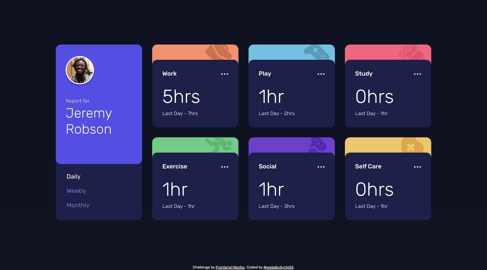

# Frontend Mentor - Time tracking dashboard solution

This is a solution to the [Time tracking dashboard challenge on Frontend Mentor](https://www.frontendmentor.io/challenges/time-tracking-dashboard-UIQ7167Jw). Frontend Mentor challenges help you improve your coding skills by building realistic projects. 

## Table of contents

- [Overview](#overview)
  - [The challenge](#the-challenge)
  - [Screenshot](#screenshot)
  - [Links](#links)
- [My process](#my-process)
  - [Built with](#built-with)
  - [What I learned](#what-i-learned)
- [Author](#author)

## Overview

### The challenge

Users should be able to:

- View the optimal layout for the site depending on their device's screen size
- See hover states for all interactive elements on the page
- Switch between viewing Daily, Weekly, and Monthly stats

### Screenshot

### Links

- Solution URL: [https://github.com/webdevbynight/time-tracking-dashboard-main](https://github.com/webdevbynight/time-tracking-dashboard-main)
- Live Site URL: [https://webdevbynight.github.io/time-tracking-dashboard-main/](https://webdevbynight.github.io/time-tracking-dashboard-main/)

## My process

### Built with

- Semantic HTML5 markup
- CSS (via SCSS)
  - custom properties
  - logical properties
  - flexbox
  - grid
- JavaScript (via TypeScript)
- Mobile-first workflow

### What I learned

I learnt the way of building a grid layout with the keyword `auto-fit`. I thought it would be complicated to use it, but it is as easy as to use the `repeat()` function, where such a keyword is used. Combined with the use of the `clamp()` function to define the grid container width, I managed not to multiply media queries.

## Author

- Website - [Victor Brito](https://victor-brito.dev)
- Frontend Mentor - [@webdevbynight](https://www.frontendmentor.io/profile/webdevbynight)
- Mastodon - [@webdevbynight](https://mastodon.social/webdevbynight)
